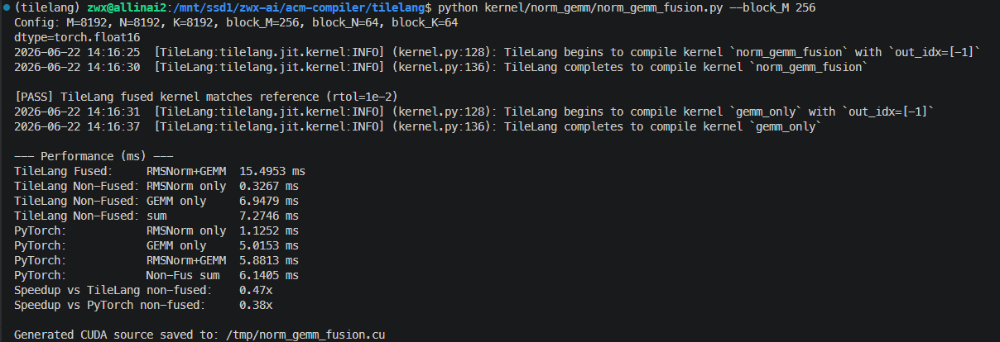
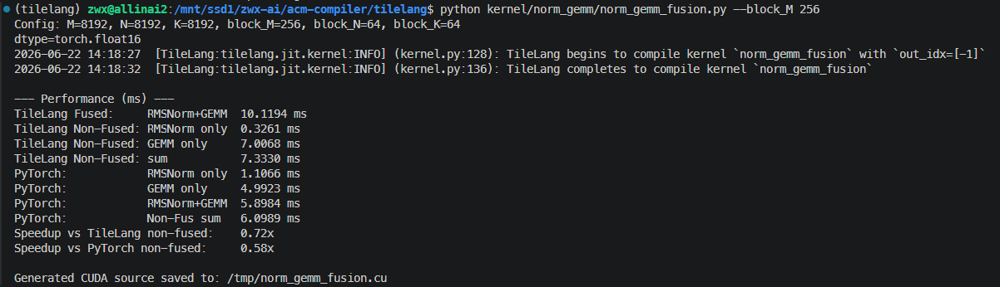
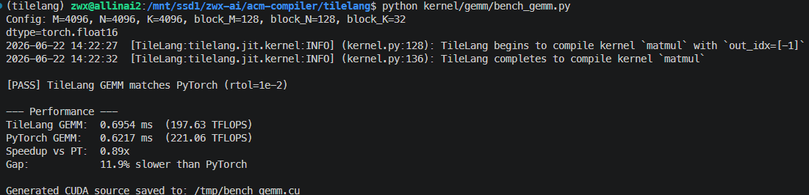

# Report

## block 参数选取

先试了一下官方 examples/ 里的 GEMM，(block_M, block_N, block_K) 的最优组合是 (128, 128, 32), 官方给出的也是这个。

norm + GEMM fusion 需要复用 local，那么就必须要 block_N = block_K。对于 GEMM 来说，满足这个条件的参数组合里，(256, 64, 64) 是最优的，跑 fusion 比之前试出来的 (128, 64, 64) 更好。

(A800)

N=M=K=8192

| block_N | block_M | block_K | time |
|---------|---------|---------|------|
| 128 | 128 | 16 | 6.964926714285713ms |
| 128 | 128 | 32 | 6.2227125625ms       (GEMM best) |
| 128 | 128 | 64 | 6.522300466666668ms |
| 64 | 64 | 16 | 12.757065857142855ms |
| 64 | 64 | 32 | 11.299451750000001ms |
| 64 | 64 | 64 | 10.860972ms |
| 256 | 256 | 16 | 113.81413500000001ms |
| 256 | 256 | 32 | 59.324331ms |
| 128 | 64 | 64 | 7.612522307692305ms|
| 256 | 64 | 64 | 6.402968999999999ms (fusion best) |
| 128 | 32 | 32 | 10.765322333333335ms |
| 256 | 32 | 32 | 9.410565099999996ms |
| 512 | 32 | 32 | 10.559959333333332ms |
| 64 | 128 | 128 | 9.626644999999998ms |

## local 复用

那可不可以不复用 local 呢？没试出来，但是在这个过程中发现 tilelang 那个报错不是因为在一个 kernel 里不能放两种大小不一样，且都很大的 fragment (这好像也说不通)。让 AI 多试了几种写法，基本上都是允许两种 fragment 同时存在的，但是应该是不能让它们的生命周期 overlap。但我不太理解复不复用 local 对生命周期应该本质影响不大，都可以保证一个时刻内需要的寄存器不会吃满，感觉是 tilelang 分析的时候写得不够好。

不过这其实都不算是大问题......

## norm + GEMM 不适合 fuse 的原因

在分析 local 的时候我才注意到，$a^2_{i,j}$ 和 $\sum_{j=1}^{n}a^2_{i,j}$ 等不止算了一次。对于所有 bx 相同的线程块，它们都会把这些量算一遍，把原本 $O(n^2)$ 级别的计算 overhead 到了 $O(n^3)$......

O(n^3)

O(n^2)

把这一块儿注释掉之后效率确实提高了不少...... 但是还是比不上 PyTorch，因为前面说的参数的原因。而且，tilelang 官方实现的 GEMM 甚至也比 PyTorch 慢一点。

于是，开始思考能不能把 overhead 去掉。发现很困难：

- 如果不用 (block_N, block_M) 的划分方式，用 (block_N, block_K) 来保证每一个 A 里的元素只算一次 elementwise square，那 GEMM 的时候没法写回结果，因为给结果的每一个 block 的贡献可能会被同时到达。

- 如果用 (block_N, block_M) 的划分方式，那就不得不再单独枚举 k 来算 $\sum_{j={1}}^{n}a^2_{i,j}$，除非不 fuse。
